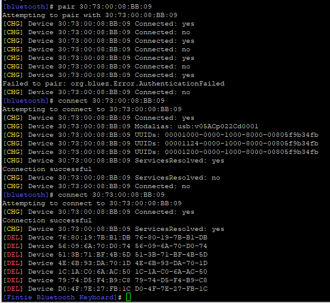

# RaspberryPi Bluetooth Keyboard Connection

## From the CLI

1. Enter into bluetooth interactive mode: `sudo bluetoothctl`

2. Turn the BT agent on: `agent on`, then `default agent`

3. Start scanning for BT devices: `scan on`. The unique addresses of all the Bluetooth devices around the Raspberry Pi will appear and look something like an alphanumeric `XX:XX:XX:XX:XX:XX`. If you make the device you want to pair discoverable (or put it into pairing mode), the device nickname may appear to the right of the address. If not, you will have to do a little trial and error or waiting to find the correct device.

4. Pair Device: `pair [device BT hex address]`, basically `pair XX:XX:XX:XX:XX:XX`

5. IF you're pairing a keyboard, you will need to enter a six-digit string of numbers. You will see that the device has been paired, but it may not have connected. To connect the device, type `connect XX:XX:XX:XX:XX:XX`.

